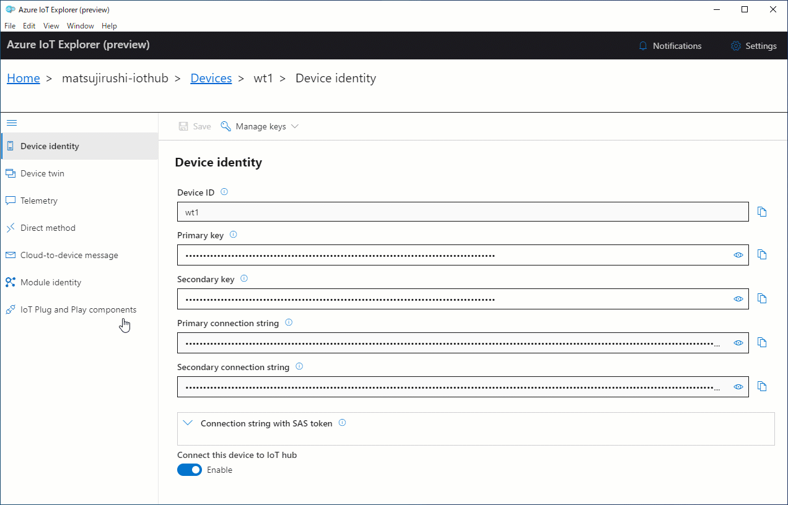

# Welcome to wioterminal-azureiot-example
[](/LICENSE)

This sample application shows you how to connect your [Wio Terminal](https://www.seeedstudio.com/Wio-Terminal-p-4509.html) from Seeed to [Azure IoT Hub](https://azure.microsoft.com/services/iot-hub). It is built on top of the [Azure SDK for Embedded C](https://github.com/Azure/azure-sdk-for-c), a small footprint, easy-to-port library for communicating with Azure services.

As the Wio Terminal is one of PlatformIO's (many!) supported platforms, the sample is conveniently made available as a PlatformIO project. This means that you don't have to worry about installing the [multiple Arduino libraries](https://wiki.seeedstudio.com/Wio-Terminal-Network-Overview/) the Wio Terminal requires for Wi-Fi & TLS, and you don't need to manually install any other third-party library either! All dependencies are automatically fetched from Github by the PlatformIO Library Manager.

  - [Running the sample](#running-the-sample)
  - [Testing the sample](#testing-the-sample)
    - [Testing that telemetry is correctly sent to Azure IoT Hub](#testing-that-telemetry-is-correctly-sent-to-azure-iot-hub)
    - [Sending a command from Azure IoT Hub](#sending-a-command-from-azure-iot-hub)
  - [A few words on the Azure SDK for Embedded C and how it's been ported to Wio Terminal](#a-few-words-on-the-azure-sdk-for-embedded-c-and-how-its-been-ported-to-wio-terminal)

## Running the sample

In order to run the sample, update the macro declarations in [``config.h``](include/config.h) with your Wi-Fi SSID and password, as well as IoT Hub credentials (Azure IoT Hub host name, device id, and symmetric key).

```cpp
//#define USE_DPS

// Wi-Fi
#define IOT_CONFIG_WIFI_SSID			"[wifi ssid]"
#define IOT_CONFIG_WIFI_PASSWORD		"[wifi password]"

#if !defined(USE_DPS)
// Azure IoT Hub
#define IOT_CONFIG_IOTHUB			"[Azure IoT Hub host name].azure-devices.net"
#define IOT_CONFIG_DEVICE_ID			"[device id]"
#define IOT_CONFIG_SYMMETRIC_KEY		"[symmetric key]"
#define IOT_CONFIG_MODEL_ID			"dtmi:seeedkk:wioterminal:wioterminal_azureiot_example;1"
#else
// Azure IoT Hub DPS
#define IOT_CONFIG_GLOBAL_DEVICE_ENDPOINT	"global.azure-devices-provisioning.net"
#define IOT_CONFIG_ID_SCOPE			"[id scope]"
#define IOT_CONFIG_REGISTRATION_ID		"[device id]"
#define IOT_CONFIG_SYMMETRIC_KEY		"[symmetric key]"
#define IOT_CONFIG_MODEL_ID			"dtmi:seeedkk:wioterminal:wioterminal_azureiot_example;1"
#endif // USE_DPS
```

Use the [PlatformIO IDE](https://marketplace.visualstudio.com/items?itemName=platformio.platformio-ide) (VS Code extension) or the [PlatformIO command-line interface](https://platformio.org/install/cli) to deploy the application to your Wio Terminal. 

Once running, the sample will connect to IoT Hub and: 

* send **telemetry**—the acceleration values from the 3-axis acceleration sensor—every 2 second.
* listen to a `ringBuzzer` **command** that, when triggered from the Cloud will... ring the buzzer! The duration is provided as a command parameter.

## Testing the sample

You can use the [Azure IoT Explorer](https://github.com/Azure/azure-iot-explorer/releases) to test that your Wio Terminal is properly connected to Azure IoT Hub, i.e that it is regularly sending telemetry data, and responding to commands.

### Testing that telemetry is correctly sent to Azure IoT Hub

To **check that telemetry data is correctly sent**, you will want to subscribe to the telemetry feed of your device. Since this code sample leverages IoT Plug and Play, Azure IoT Explorer will provide you with extra information regarding the data model for your acceleration sensor data (e.g the unit of measurement being "g") if you enable the "Show modeled events" option.


### Sending a command from Azure IoT Hub

In order to send the `ringBuzzer` command, head over to the "Commands" section of the IoT Plug and Play default component of your device, enter a duration, and send the command.



## A few words on the Azure SDK for Embedded C and how it's been ported to Wio Terminal

Note: As of today, the Azure SDK for Embedded C is still being actively developed, therefore, it hasn't been officially released as an Arduino or PlatformIO library. To make it easier for you to get started, the Azure IoT client libraries have been included in the [`lib/azure-sdk-for-c`](lib/azure-sdk-for-c) folder. You can synchronize them with the latest version from the Embedded C SDK github repository by running the [`lib/download_aziot_embedded_c_lib.sh`](download_aziot_embedded_c_lib.sh) script.

You can read more on the Azure IoT client library [here](https://github.com/Azure/azure-sdk-for-c/tree/master/sdk/docs/iot#azure-iot-clients), but in a nutshell, here's what had to be done to get the Wio Terminal connected:

* As this sample uses symmetric keys to authenticate, a [security token](https://docs.microsoft.com/en-us/azure/iot-hub/iot-hub-devguide-security#security-tokens) needs to be generated.
  * Since the generated token has an expiration date (typically set to a few hours in the future), **we need to know the current date and time**. We use an [NTP](https://github.com/sstaub/NTP) library to get the current time from a time server.
  * The token includes an **HMAC-SHA256 signature string that needs to be base64-encoded**. Luckily, the [recommended WiFi+TLS stack](https://wiki.seeedstudio.com/Wio-Terminal-Network-Overview/#libraries-installation) of the Wio Terminal already includes Mbed TLS, making it relatively simple to compute HMAC signatures (ex. `mbedtls_md_hmac_starts`) and perform base64 encoding (ex. `mbedtls_base64_encode`).
* The Azure IoT client libraries help with crafting MQTT topics that follow the [Azure IoT conventions](https://docs.microsoft.com/en-us/azure/iot-hub/iot-hub-mqtt-support), but you still need to **provide your own MQTT library**. In fact, that is a major difference with the historical Azure IoT C SDK, for which the MQTT implementation was baked into it. Since it is widely supported and just worked out-of-the-box, this sample uses the [`PubSubClient`](https://github.com/knolleary/pubsubclient) MQTT library from [Nick O'Leary](https://github.com/knolleary).
* And of course, one has to implement their own **application logic**. For this sample application, this meant using the Wio Terminal's acceleration sensor driver to get acceleration data every 2 seconds, or hooking up the `ringBuzzer` command to actual embedded code that rings the buzzer.

## Author

👤 **Benjamin Cabé**

* Website: https://blog.benjamin-cabe.com
* Twitter: [@kartben](https://twitter.com/kartben)
* Github: [@kartben](https://github.com/kartben)
* LinkedIn: [@benjamincabe](https://linkedin.com/in/benjamincabe)

👤 **Seeed K.K.**

* Website: https://www.seeed.co.jp/
* Twitter: [@SeeedJP](https://twitter.com/SeeedJP)

## 🤝 Contributing

Contributions, issues and feature requests are welcome!

Feel free to check [issues page](https://github.com/SeeedJP/wioterminal-azureiot-example/issues).

## Show your support

Give a ⭐️ if this project helped you!


## 📝 License

Copyright &copy; 2020 [Benjamin Cabé](https://github.com/kartben).  
Copyright &copy; 2020 Seeed K.K.

This project is [MIT](/LICENSE) licensed.

***
_This README was generated with ❤️ by [readme-md-generator](https://github.com/kefranabg/readme-md-generator)_
